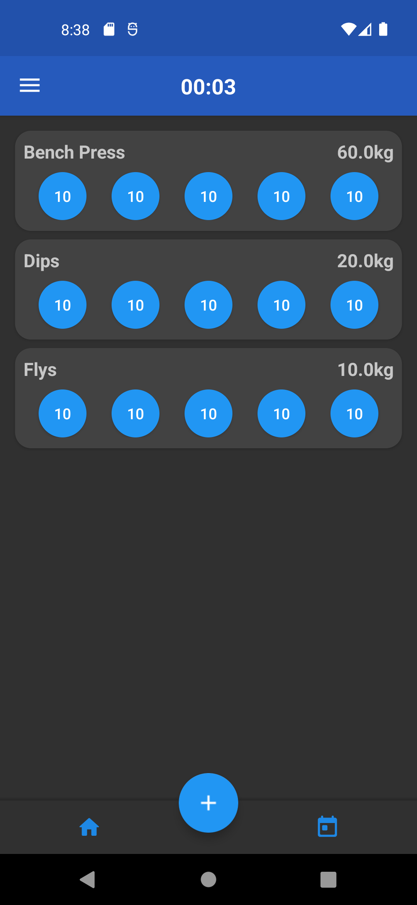
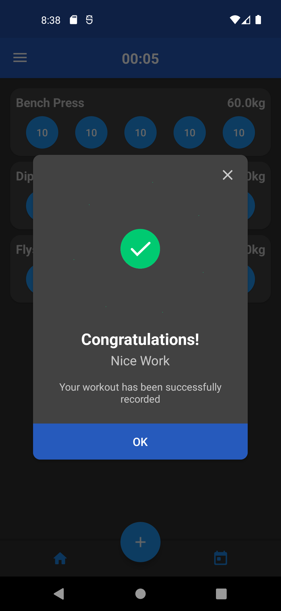

# Android-WorkoutTracker
Free to use demo repo of an android workout tracker application.
Features a local SQL Lite DB
Light/Dark Color Scheme
Foreground Service and chronometer to keep track of your workouts.

Notes: 
- There is a bug when switching from dark back to light mode
- Should probably look to use ROOM instead of RAW sql lite statements. 
(I did not have enough knowledge at the time to make it work...)
- Single press to increment your counter for exercises, long press to minus 1 from your counter.

This app may not be production ready, but can serve as a pretty cool foundational base for anyone who wants to make something similar.

